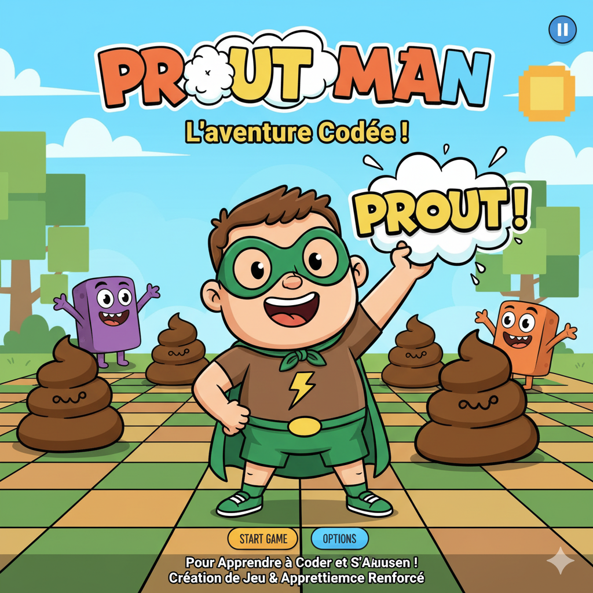
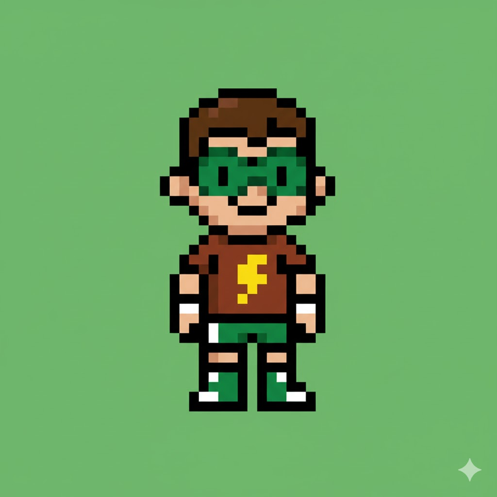
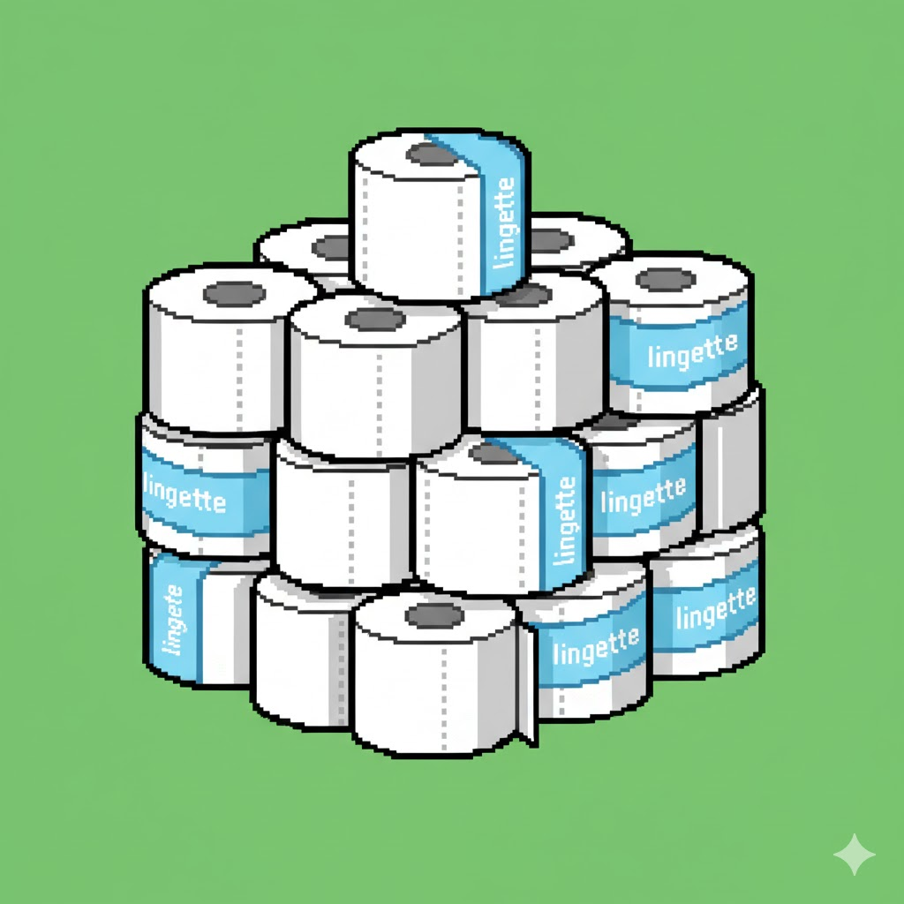
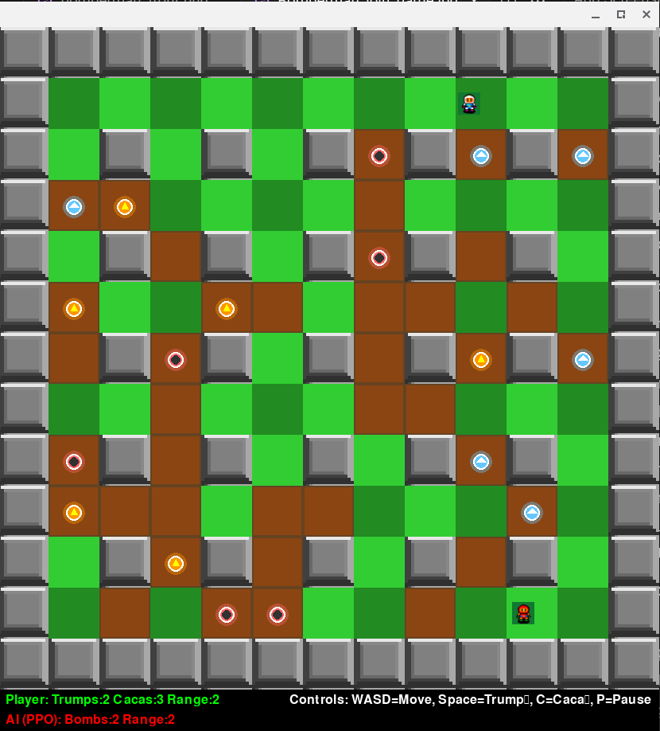
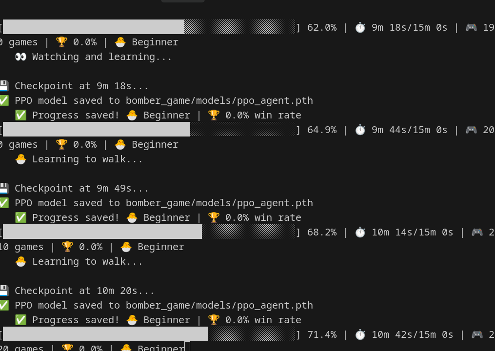
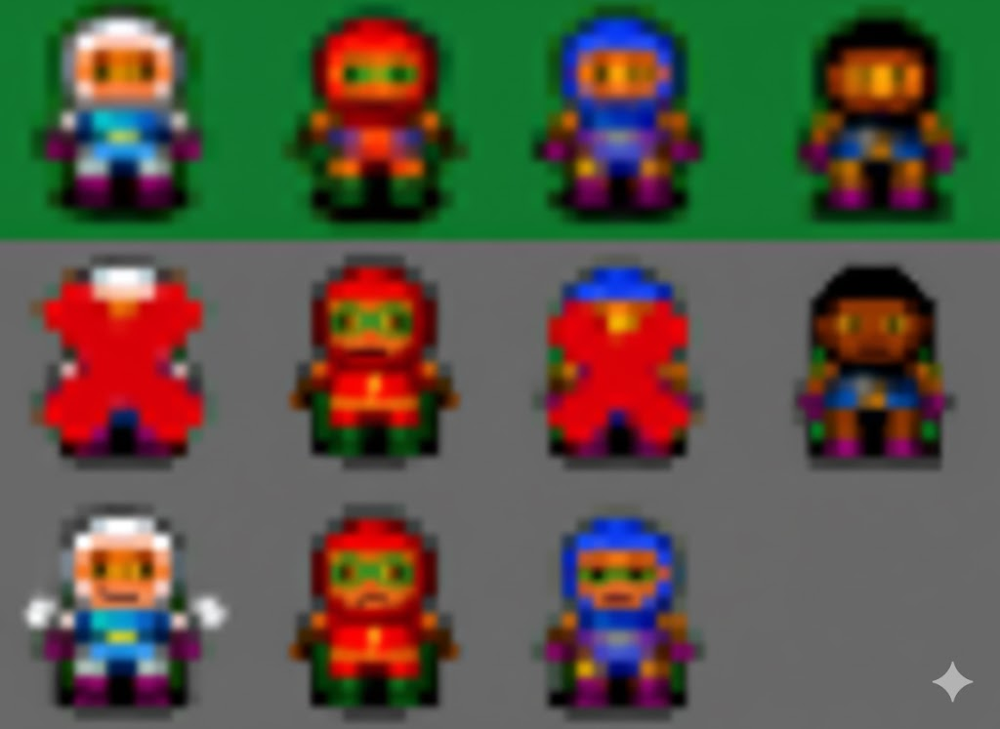
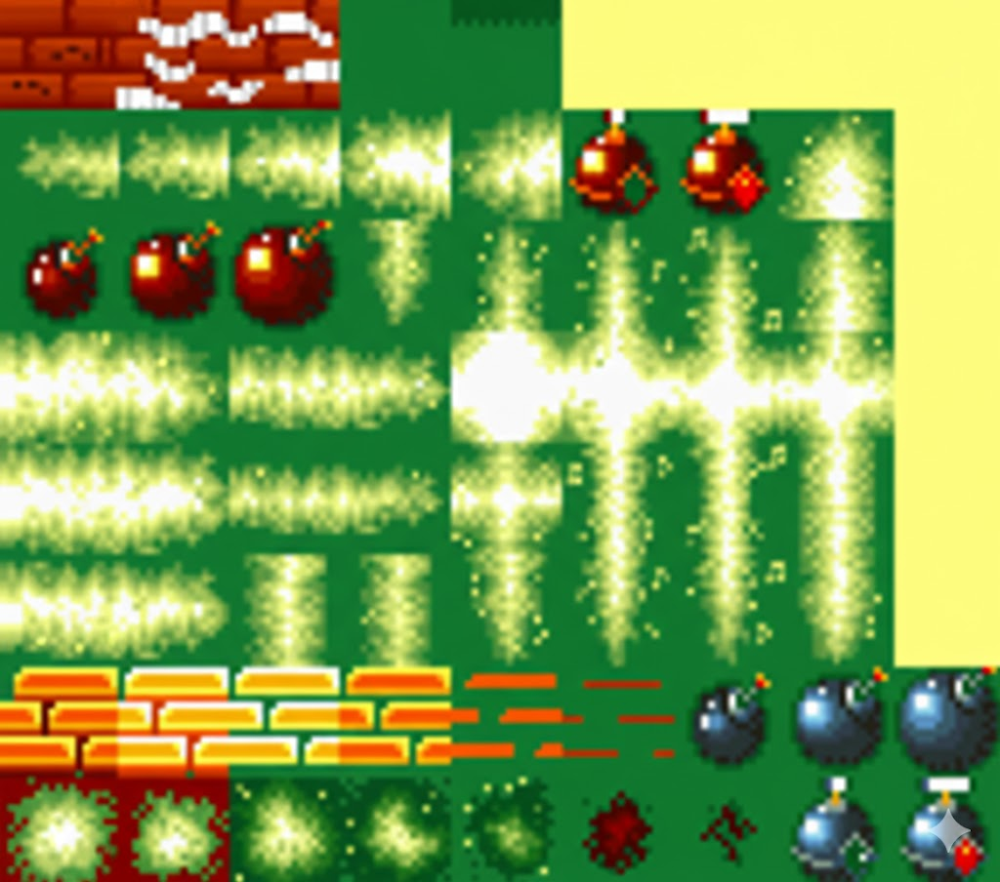

<div align="center">

# 💨 PROUTMAN - The Funniest Way to Learn Python & AI! 🤖

### *Created by a Kid, For Kids!* 🎮

**An Educational Bomberman Game That Makes Learning Programming FUN!**




[](https://www.python.org/)
[](https://www.pygame.org/)
[](https://en.wikipedia.org/wiki/Reinforcement_learning)
[](LICENSE)
[](README.md)

</div>

---

## 🌟 **The Story Behind Proutman**

> *"Papa, let's make a funny game with prouts (farts) and caca (poop)! It will make learning Python fun for kids!"*  
> **— My Son's Brilliant Idea** 💡

This game was **inspired by my son's creativity** to make programming education hilarious and engaging for children! Instead of boring examples, kids learn Python, AI, and game development by creating **smelly trump bombs** 💨 and **strategic poop blocks** 💩!

**Proutman** (French for "Fart Man") transforms the classic Bomberman into an **educational adventure** where kids:
- 🐍 **Learn Python** programming
- 🤖 **Understand AI** and reinforcement learning
- 🎮 **Create games** from scratch
- 😂 **Have FUN** while learning!

<div align="center">


</div>

---

## 🎯 **Why Proutman is Perfect for Kids**

### 🎓 **Educational Value**
- ✅ **Python Programming** - Real code, real skills
- ✅ **Game Development** - Build your own games
- ✅ **Artificial Intelligence** - Train smart AI opponents
- ✅ **Problem Solving** - Strategic thinking
- ✅ **Math & Logic** - Applied in fun ways

### 😂 **Fun Factor**
- 💨 **Hilarious Theme** - Farts and poop (kids love it!)
- 🎨 **Colorful Graphics** - Beautiful sprites
- 🎮 **Engaging Gameplay** - Addictive and challenging
- 🤖 **Smart AI** - Learn by playing against AI
- 🏆 **Achievements** - Track your progress

### 👨‍👩‍👧‍👦 **Family Friendly**
- 🇫🇷 **French Humor** - Inspired by French kids' humor
- 🌍 **Universal Appeal** - Fun for all cultures
- 👶 **Age Appropriate** - Safe and educational
- 🎓 **Parent Approved** - Real learning outcomes

---

<div align="center">

## 🚀 **Quick Start - Play in 2 Minutes!**

</div>

### **Step 1: Setup (One Time)**

```bash
# Clone or download this project
cd ~/CascadeProjects/windsurf-project-2

# Setup your environment
source setup_terminal.sh
```

### **Step 2: Play!**

```bash
./launch_bomberman.sh
```

**That's it!** 🎉

---

<div align="center">

## 📸 **Screenshots - See It In Action!**

</div>

<div align="center">

### **🎮 Proutman Gameplay**



*Proutman in action! Drop trump bombs 💨, avoid explosions 💥, and defeat the AI opponent! 🤖*

</div>

<div align="center">

### **🤖 AI Training Mode**



*Training the AI agent! Watch it learn strategies and improve over time. 📊*

</div>

---

<div align="center">

## 🎮 **Game Features**

</div>

<table>
<tr>
<td width="33%" align="center">

### 💨 **Smelly Trump Bombs**
Drop hilarious fart bombs that explode in a cross pattern! Destroy walls and defeat enemies with your stinky power!



</td>
<td width="33%" align="center">

### 💩 **Caca Blocks**
Place strategic poop blocks to trap enemies or protect yourself! A unique mechanic that adds tactical depth!



</td>
<td width="33%" align="center">

### 🚽 **Toilet Walls**
Destroy toilet walls to find power-ups! Hilarious French bathroom humor meets strategic gameplay!


</td>
</tr>
</table>

### 🎯 **Core Features**

| Feature | Description | Learning Value |
|---------|-------------|----------------|
| 🎮 **Player vs AI** | Battle against smart AI | Understand AI behavior |
| 💨 **Trump Bombs** | Place explosive farts | Learn game mechanics |
| 💩 **Caca Blocks** | Strategic obstacles | Problem-solving skills |
| ⚡ **Power-ups** | Collect upgrades | Reward systems |
| 🤖 **AI Training** | Train your own AI | Reinforcement learning |
| 📊 **Statistics** | Track performance | Data analysis |
| 🎨 **Custom Sprites** | Beautiful graphics | Art appreciation |

---

<div align="center">

## 🎓 **What Kids Will Learn**

</div>

### 🐍 **Python Programming**

```python
# Kids learn real Python code!
class Player:
    def __init__(self, x, y):
        self.x = x
        self.y = y
        self.bombs = 1
    
    def place_bomb(self):
        # Drop a trump bomb!
        return Bomb(self.x, self.y)
```

**Concepts Covered:**
- ✅ Variables and data types
- ✅ Functions and classes
- ✅ Loops and conditions
- ✅ Object-oriented programming
- ✅ Game loops and events

---

### 🤖 **Artificial Intelligence**

Kids can **train their own AI** using reinforcement learning!

```bash
# Train your AI opponent
./train.sh

# Choose training mode:
# 1. Complete Pipeline (10 min)
# 2. Bootstrap Only (5 min)
# 3. Quick Training (5 min)
```

**AI Concepts:**
- 🧠 **Machine Learning** - How computers learn
- 🎯 **Reinforcement Learning** - Learning by trial and error
- 🤖 **Neural Networks** - How AI thinks
- 📊 **Training & Testing** - Improving AI performance
- 🎮 **Game AI** - Making smart opponents

---

### 🎮 **Game Development**

Learn how games are built from scratch!

**Topics Covered:**
- 🎨 **Graphics & Sprites** - Drawing game elements
- 🎵 **Sound Effects** - Adding audio
- 🕹️ **Input Handling** - Keyboard controls
- ⚔️ **Collision Detection** - Interactions
- 🎯 **Game States** - Menus, gameplay, game over
- 📊 **Score Systems** - Tracking progress

---

<div align="center">

## 🎮 **How to Play**

</div>

### **Controls**

| Key | Action |
|-----|--------|
| ⬆️ **W** or **↑** | Move Up |
| ⬇️ **S** or **↓** | Move Down |
| ⬅️ **A** or **←** | Move Left |
| ➡️ **D** or **→** | Move Right |
| **SPACE** | Drop Trump Bomb 💨 |
| **C** | Place Caca Block 💩 |
| **P** | Pause Game |
| **R** | Restart (when game over) |
| **ESC** | Quit |

### **Objective**

1. 💨 **Destroy walls** with trump bombs
2. 💩 **Trap enemies** with caca blocks
3. ⚡ **Collect power-ups** to get stronger
4. 🏆 **Defeat the AI** opponent
5. 🎯 **Don't get caught** in explosions!

---

<div align="center">

## 🎬 **Feature Demonstrations**

</div>

### **🎮 Live Gameplay**

<div align="center">

</div>

**What you see:**
- 🎮 **Player (Blue)** - You control Proutman
- 🤖 **AI Opponent (Red)** - Smart AI that learns
- 💨 **Trump Bombs** - Explosive farts in cross pattern
- 🧱 **Destructible Walls** - Break them for power-ups
- 🏰 **Solid Blocks** - Indestructible obstacles
- ⚡ **Power-ups** - Collect to get stronger

### **🤖 AI Training in Progress**

<div align="center">

</div>

**Training mode:**
- 📊 **Headless mode** - No graphics, faster training
- 🧠 **Learning strategies** - AI improves over time
- 📈 **Progress tracking** - Win rate, episodes, time
- 💾 **Auto-save** - Model saved every few minutes
- 🎯 **Bootstrap + RL** - Heuristics then reinforcement learning

### **🎨 Game Elements**

<table>
<tr>
<td width="50%" align="center">
<br>
<b>🎮 Proutman Character</b><br>
The hilarious hero with stinky powers!
</td>
<td width="50%" align="center">
<br>
<b>🚽 Toilet Walls</b><br>
French bathroom humor at its finest!
</td>
</tr>
</table>

### **💨 Trump Bomb Mechanics**

<div align="center">

</div>

**How it works:**
1. Press **SPACE** to drop a trump bomb 💨
2. Bomb explodes after 3 seconds 💥
3. Explosion travels in **cross pattern** (up, down, left, right)
4. Destroys walls and defeats enemies
5. Don't get caught in your own explosion!

### **💩 Caca Block Strategy**

<div align="center">

</div>

**Strategic uses:**
1. Press **C** to place a caca block 💩
2. Blocks enemy movement
3. Creates safe zones
4. Traps opponents
5. Protects from explosions

---

<div align="center">

## 🤖 **Train Your Own AI!**

</div>

One of the **coolest features** - kids can train their own AI opponent!

### **Interactive Training Menu**

```bash
./train.sh
```

<div align="center">

```
╔════════════════════════════════════════════════════════════════════╗
║     💨 PROUTMAN AI - Training Mode Selector 🤖                     ║
╚════════════════════════════════════════════════════════════════════╝

📋 Training Modes:

1. Complete Pipeline (Recommended for first time)
   └─ Total: ~10 minutes, Win Rate: 50-60%

2. Bootstrap Only (Teach basic strategies)
   └─ Time: ~5 minutes, Win Rate: 30-40%

3. Quick Training (5-minute session)
   └─ Time: 5 minutes, Improves by 5-10%

4. Extended Training (15-minute session)
   └─ Time: 15 minutes, Improves by 10-20%

5. Custom Training (Configure duration)
   └─ Time: Your choice

6. Reset & Restart (Start from scratch)

7. View Statistics (Check progress)

Select training mode [0-7]:
```

</div>

### **What Happens During Training?**

The AI learns by:
1. 🎮 **Playing thousands of games**
2. 🧠 **Learning from mistakes**
3. 🎯 **Improving strategies**
4. 📊 **Tracking progress**

Kids can see the AI get **smarter in real-time**!

---

<div align="center">

## 📚 **Learning Path for Kids**

</div>

### **Level 1: Beginner (Ages 8-10)** 🌱

**Start Here:**
1. ✅ Play the game and have fun!
2. ✅ Understand the controls
3. ✅ Learn basic strategy
4. ✅ Read simple Python code

**Time:** 1-2 hours  
**Goal:** Understand how games work

---

### **Level 2: Intermediate (Ages 10-12)** 🌿

**Next Steps:**
1. ✅ Modify game settings (speed, colors)
2. ✅ Add new power-ups
3. ✅ Change bomb behavior
4. ✅ Train the AI opponent

**Time:** 5-10 hours  
**Goal:** Make simple modifications

---

### **Level 3: Advanced (Ages 12-14)** 🌳

**Advanced Topics:**
1. ✅ Create new game modes
2. ✅ Design custom levels
3. ✅ Implement new features
4. ✅ Understand AI algorithms

**Time:** 20+ hours  
**Goal:** Build your own game

---

### **Level 4: Expert (Ages 14+)** 🚀

**Master Level:**
1. ✅ Build games from scratch
2. ✅ Create AI systems
3. ✅ Publish your games
4. ✅ Teach others!

**Time:** 50+ hours  
**Goal:** Become a game developer

---

<div align="center">

## 📖 **Documentation & Resources**

</div>

### **📚 Comprehensive Guides**

| Document | Description | Best For |
|----------|-------------|----------|
| [🚀 Setup Guide](SETUP_GUIDE.md) | Complete setup instructions | Getting started |
| [🎓 Education Plan](EDUCATION_PLAN.md) | Learning roadmap | Parents & teachers |
| [🤖 AI Training](HEURISTIC_BOOTSTRAP.md) | AI training details | Advanced learners |
| [⚡ Quick Start](QUICK_START_TRAINING.md) | Fast training guide | Quick reference |
| [📊 Project Summary](PROJECT_SUMMARY.md) | Technical overview | Developers |

### **🎮 Game Documentation**

- **TRUMP_MAN_COMPLETE.md** - Complete game guide
- **TRUMP_MAN_V2_FEATURES.md** - Feature details
- **VISUAL_UPGRADE.md** - Graphics guide
- **spec.md** - Technical specifications

### **🔧 Developer Resources**

```bash
# View all documentation
ls *.md

# Read specific guide
cat SETUP_GUIDE.md
cat EDUCATION_PLAN.md
```

---

<div align="center">

## 🛠️ **For Parents & Teachers**

</div>

### **Why Proutman is Educational**

✅ **STEM Learning**
- Programming fundamentals
- Mathematical concepts
- Logical thinking
- Problem-solving skills

✅ **21st Century Skills**
- Computational thinking
- Creativity
- Persistence
- Debugging mindset

✅ **Safe Learning Environment**
- No internet required
- No ads or purchases
- Age-appropriate content
- Open source code

### **Classroom Use**

Perfect for:
- 🏫 **Computer Science Classes**
- 🎓 **Coding Clubs**
- 👨‍👩‍👧‍👦 **Homeschooling**
- 🎮 **Game Design Courses**

### **Learning Outcomes**

After completing this project, students will:
- ✅ Write Python programs
- ✅ Understand game development
- ✅ Know AI basics
- ✅ Debug code
- ✅ Read documentation
- ✅ Work with files and data

---

<div align="center">

## 🎨 **Game Assets & Graphics**

</div>

The game features **beautiful custom sprites** with hilarious French bathroom humor!

<div align="center">

### **🖼️ Visual Gallery**

<table>
<tr>
<td align="center" width="25%">
<br>
<b>Proutman Character</b><br>
The hero himself!
</td>
<td align="center" width="25%">
<br>
<b>Player Sprites</b><br>
Animated characters
</td>
<td align="center" width="25%">
<br>
<b>Game Tiles</b><br>
Walls & floors
</td>
<td align="center" width="25%">
<br>
<b>Toilet Walls</b><br>
French humor!
</td>
</tr>
</table>

</div>

### **Character Sprites**
- 🎮 Player animations (Proutman version)
- 🤖 AI opponent sprites
- 💨 Trump bomb animations
- 💥 Explosion effects

### **Tile Graphics**
- 🧱 Destructible walls
- 🏰 Indestructible blocks
- 🚽 Toilet walls (hilarious!)
- 🌱 Grass floor
- ⚡ Power-up items

### **Special Effects**
- 💨 Smoke particles
- 💥 Explosion animations
- ✨ Power-up sparkles
- 🎯 UI elements

**All graphics are included in:** `bomber_game/assets/images/`

---

<div align="center">

## 🚀 **Advanced Features**

</div>

### **🤖 AI Training System**

Train your AI using **reinforcement learning**:

```bash
# Setup environment
source setup_terminal.sh

# Start training
./train.sh

# View progress
./train.sh → Option 7
```

**Training Features:**
- 🎓 **Heuristic Bootstrap** - Teach basic strategies
- 🧠 **Reinforcement Learning** - Learn by playing
- 📊 **Progress Tracking** - See improvement
- 💾 **Model Persistence** - Save trained AI
- ⚡ **Quick Sessions** - 5-minute training

### **📊 Statistics & Analytics**

Track your AI's performance:
- 📈 Win rate over time
- 🎮 Total games played
- ⏱️ Training duration
- 🎯 Skill level
- 📅 Training history

---

<div align="center">

## 💻 **Technical Details**

</div>

### **Built With**

| Technology | Purpose |
|------------|---------|
| 🐍 **Python 3.8+** | Programming language |
| 🎮 **Pygame** | Game engine |
| 🤖 **PyTorch** | AI/ML framework |
| 📊 **NumPy** | Numerical computing |
| 🎨 **Custom Sprites** | Graphics |

### **Project Structure**

```
proutman/
├── 🎮 bomber_game/          # Main game package
│   ├── entities/            # Game objects
│   ├── agents/              # AI system
│   ├── assets/              # Graphics & sounds
│   └── models/              # Trained AI models
├── 🚀 Setup Scripts
│   ├── setup_terminal.sh    # Environment setup
│   ├── train.sh             # Training menu
│   └── launch_bomberman.sh  # Game launcher
├── 🤖 AI Training
│   ├── bootstrap_agent.py   # Heuristic training
│   ├── quick_train_agent.py # RL training
│   └── train_with_heuristics.py  # Complete pipeline
└── 📚 Documentation/         # Guides & tutorials
```

---

<div align="center">

## 🎯 **Getting Started - Complete Guide**

</div>

### **1. Prerequisites**

- 💻 Computer with Linux, Mac, or Windows
- 🐍 Python 3.8 or higher
- 🎮 Keyboard for controls
- 😊 Sense of humor!

### **2. Installation**

```bash
# Navigate to project
cd ~/CascadeProjects/windsurf-project-2

# Setup environment (first time only)
source setup_terminal.sh

# This will:
# ✅ Create virtual environment
# ✅ Install dependencies
# ✅ Setup paths
# ✅ Create aliases
```

### **3. Play the Game**

```bash
# Launch game
./launch_bomberman.sh

# Or use the alias
play
```

### **4. Train Your AI**

```bash
# Open training menu
./train.sh

# Or use the alias
train
```

### **5. Learn & Modify**

```bash
# Read the code
cat bomber_game/entities/player.py

# Modify settings
nano bomber_game/config.py

# Create your own features!
```

---

<div align="center">

## 🌟 **Success Stories**

</div>

> *"My son learned Python in 2 weeks by modifying Proutman! He's now creating his own games!"*  
> **— Parent, France** 🇫🇷

> *"The AI training feature is brilliant! Students see machine learning in action."*  
> **— Computer Science Teacher** 👨‍🏫

> *"Finally, a programming project that makes kids laugh while learning!"*  
> **— Coding Club Leader** 🎓

---

<div align="center">

## 🤝 **Contributing**

</div>

We welcome contributions from kids and adults!

### **Ways to Contribute**

- 🐛 **Report bugs** - Help us improve
- 💡 **Suggest features** - Share your ideas
- 🎨 **Create sprites** - Add graphics
- 📚 **Write tutorials** - Help others learn
- 🌍 **Translate** - Make it multilingual
- 🎮 **Share** - Tell your friends!

### **For Young Developers**

This is a **great first open source project**!
- ✅ Beginner-friendly code
- ✅ Clear documentation
- ✅ Fun project
- ✅ Real-world skills

---

<div align="center">

## 🙏 **Credits & Thanks**

</div>

### **Special Thanks**

- 🎨 **Yoann Humeau** - Original Bomberman sprites
  - GitHub: [YoannHumeau/Bomberman](https://github.com/YoannHumeau/Bomberman)
  - Thank you for the amazing graphics!

- 💡 **My Son** - The creative genius behind Proutman
  - For the hilarious idea
  - For inspiring kids everywhere
  - For making learning fun!

- 🎮 **Classic Bomberman** - Game inspiration
- 🤖 **CoderOneHQ** - AI competition inspiration
- 👨‍👩‍👧‍👦 **Parents & Teachers** - For supporting young coders

---

<div align="center">

## 📜 **License**

</div>

This project is open source and available under the **MIT License**.

**What this means:**
- ✅ Free to use
- ✅ Free to modify
- ✅ Free to share
- ✅ Free for education
- ✅ Free for commercial use

See [LICENSE](LICENSE) file for details.

---

<div align="center">

## 🎮 **Start Your Adventure Now!**

```bash
cd ~/CascadeProjects/windsurf-project-2
source setup_terminal.sh
./launch_bomberman.sh
```

### **Let's Learn, Code, and Have Fun!** 🚀

---

### **Made with ❤️ by a Kid's Imagination**

*Proutman - Where Farts Meet Code!* 💨🤖

---

**Questions? Issues? Ideas?**  
Open an issue or start a discussion!

**Happy Coding!** 🎉

</div>

## 🎮 Development Features

- **2D Game Development**: Pygame, Arcade, Pyglet
- **3D Game Development**: Panda3D, ModernGL, Ursina
- **Physics Engines**: Pymunk (2D), PyBullet (3D)
- **Utility Modules**: Math helpers, input handling, collision detection
- **Complete Examples**: Trump Man, Space Shooter, Cube Runner

## 📁 Project Structure

```
windsurf-project-2/
├── 🎮 TRUMP MAN GAME (Featured!)
│   ├── bomber_game/              # Main game package
│   │   ├── __init__.py          # Game constants
│   │   ├── config.py            # Settings
│   │   ├── assets.py            # Asset manager
│   │   ├── game_state.py        # Game logic
│   │   ├── game_engine.py       # Main loop
│   │   ├── entities/            # Game objects
│   │   │   ├── player.py        # Player with sprites
│   │   │   ├── bomb.py          # Trump bombs
│   │   │   ├── caca.py          # Poop blocks!
│   │   │   ├── explosion.py     # Explosions
│   │   │   └── powerup.py       # Power-ups
│   │   ├── agents/              # AI system
│   │   │   └── simple_agent.py  # Smart AI
│   │   └── assets/images/       # Professional sprites
│   ├── play_bomberman.py        # Game launcher
│   ├── launch_bomberman.sh      # Quick start
│   └── 📚 Documentation/
│       ├── TRUMP_MAN_COMPLETE.md    # Complete guide
│       ├── TRUMP_MAN_V2_FEATURES.md # v2.0 features
│       ├── VISUAL_UPGRADE.md        # Sprite guide
│       └── EDUCATION_PLAN.md        # Learning path
│
├── games_2d/                # 2D examples
│   └── space_shooter.py
├── games_3d/                # 3D examples
│   └── cube_runner.py
├── utils/                   # Utilities
└── assets/                  # Shared assets
```

## 🚀 Quick Start

### 1. Install Dependencies

```bash
# Create virtual environment (recommended)
python -m venv game_dev_env
source game_dev_env/bin/activate  # On Windows: game_dev_env\\Scripts\\activate

# Install all dependencies
pip install -r requirements.txt
```

### 2. Play Trump Man! 🎮

**The Featured Educational Game:**
```bash
./launch_bomberman.sh
```

**Controls:**
- WASD or Arrows: Move
- Space: Drop Trump 💨
- C: Drop Caca 💩
- P: Pause
- R: Restart

**Read the complete guide:**
```bash
cat TRUMP_MAN_COMPLETE.md
```

---

### 3. Run Other Example Games

**2D Space Shooter (Pygame):**
```bash
python games_2d/space_shooter.py
```

**3D Cube Runner (Panda3D):**
```bash
python games_3d/cube_runner.py
```

**Original Snake Game:**
```bash
python snake_game.py
```

## 📚 Library Overview

### 2D Game Development

#### Pygame
- **Best for**: Traditional 2D games, pixel-perfect control
- **Pros**: Mature, extensive documentation, large community
- **Use cases**: Platformers, shoot-em-ups, puzzle games

#### Arcade
- **Best for**: Modern 2D games with built-in physics
- **Pros**: Modern Python practices, built-in sprite physics
- **Use cases**: Educational games, modern 2D games

#### Pyglet
- **Best for**: Performance-critical 2D games
- **Pros**: OpenGL-based, cross-platform, minimal dependencies
- **Use cases**: Real-time games, multimedia applications

### 3D Game Development

#### Panda3D
- **Best for**: Full-featured 3D games
- **Pros**: Complete game engine, built-in scene graph, physics
- **Use cases**: 3D adventures, simulations, complex 3D games

#### ModernGL
- **Best for**: Custom 3D graphics and shaders
- **Pros**: Direct OpenGL access, high performance
- **Use cases**: Graphics programming, custom renderers

#### Ursina
- **Best for**: Rapid 3D prototyping
- **Pros**: Simple API, built on Panda3D, beginner-friendly
- **Use cases**: Game jams, prototypes, educational projects

### Physics Engines

#### Pymunk (2D)
```python
import pymunk

# Create physics space
space = pymunk.Space()
space.gravity = (0, -981)  # Gravity

# Create physics body
body = pymunk.Body(1, 1666)  # mass, moment
shape = pymunk.Circle(body, 25)  # radius
space.add(body, shape)
```

#### PyBullet (3D)
```python
import pybullet as p

# Initialize physics
p.connect(p.GUI)
p.setGravity(0, 0, -9.8)

# Create collision shapes
collision_shape = p.createCollisionShape(p.GEOM_BOX, halfExtents=[1, 1, 1])
body = p.createMultiBody(1.0, collision_shape, collision_shape)
```

## 🛠️ Development Tips

### Performance Optimization

1. **Use sprite groups** in Pygame for efficient rendering
2. **Limit object creation** in game loops
3. **Use object pooling** for frequently created/destroyed objects
4. **Profile your code** with cProfile

### Code Organization

1. **Separate game logic** from rendering
2. **Use composition** over inheritance for game objects
3. **Implement game states** (menu, playing, paused, game over)
4. **Create reusable components** for common functionality

### Asset Management

```python
# Example asset loader
class AssetManager:
    def __init__(self):
        self.images = {}
        self.sounds = {}
    
    def load_image(self, name, path):
        self.images[name] = pygame.image.load(path)
    
    def get_image(self, name):
        return self.images[name]
```

## 🎯 Next Steps

### Beginner Projects
1. **Pong** - Classic paddle game
2. **Breakout** - Brick-breaking game
3. **Tetris** - Falling blocks puzzle
4. **Platformer** - Side-scrolling jump game

### Intermediate Projects
1. **Tower Defense** - Strategic defense game
2. **RPG** - Role-playing game with stats/inventory
3. **Racing Game** - 3D racing with physics
4. **Puzzle Platformer** - Physics-based puzzles

### Advanced Projects
1. **Multiplayer Game** - Network programming
2. **Procedural Generation** - Infinite worlds
3. **AI Opponents** - Game AI and pathfinding
4. **VR Game** - Virtual reality integration

## 📖 Learning Resources

### Trump Man Documentation
- **TRUMP_MAN_COMPLETE.md** - Complete game guide
- **TRUMP_MAN_V2_FEATURES.md** - Feature details
- **VISUAL_UPGRADE.md** - Sprite integration
- **EDUCATION_PLAN.md** - Learning roadmap

### External Documentation
- [Pygame Documentation](https://www.pygame.org/docs/)
- [Panda3D Manual](https://docs.panda3d.org/)
- [Arcade Documentation](https://api.arcade.academy/)

### Tutorials
- [Real Python Game Development](https://realpython.com/pygame-a-primer/)
- [Panda3D Tutorial](https://docs.panda3d.org/1.10/python/introduction/tutorial/index)
- [Game Development Patterns](https://gameprogrammingpatterns.com/)

### Communities
- [r/gamedev](https://reddit.com/r/gamedev)
- [Python Discord](https://discord.gg/python)
- [Pygame Community](https://www.pygame.org/wiki/about)

## 🐛 Troubleshooting

### Common Issues

**Import Errors:**
```bash
# Make sure you're in the virtual environment
pip list | grep pygame  # Check if installed
pip install --upgrade pygame  # Reinstall if needed
```

**Performance Issues:**
- Use `pygame.sprite.Group()` for batch operations
- Limit FPS with `clock.tick(60)`
- Optimize image formats (use .png for transparency, .jpg for photos)

**Audio Issues:**
```python
# Initialize pygame mixer before pygame
pygame.mixer.pre_init(frequency=22050, size=-16, channels=2, buffer=512)
pygame.mixer.init()
```

## 🙏 Credits

### Trump Man Sprites
- **Source**: https://github.com/YoannHumeau/Bomberman
- **Author**: Yoann Humeau
- **License**: Open Source
- Thank you for the amazing sprites!

### Inspiration
- CoderOneHQ/bomberland repository
- Classic Bomberman games
- Educational game design principles

## 🤝 Contributing

Feel free to add more examples, improve existing code, or fix bugs. This setup is designed to be a learning resource and starting point for Python game development.

##  License

This project is open source and available under the MIT License.

---

## **Start Playing Trump Man Now!**

```bash
cd ~/CascadeProjects/windsurf-project-2
./launch_bomberman.sh
```

**Perfect for learning Python, AI, and game development while having fun!** 

---

**Happy Game Development!**
